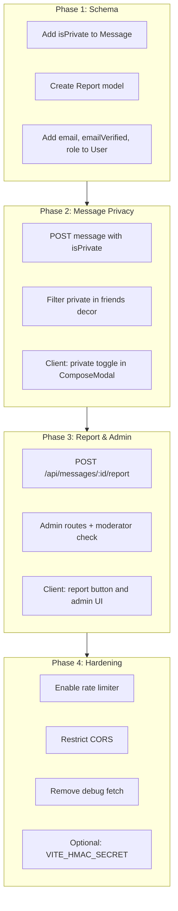

# Security Hardening and Feature Plan

## Part 1: Current Security Inventory

### 1. Authentication and Authorization

| Feature          | Implementation                                                                                                   | Location                                                                                                                                                       |
| ---------------- | ---------------------------------------------------------------------------------------------------------------- | -------------------------------------------------------------------------------------------------------------------------------------------------------------- |
| JWT-based auth   | `jsonwebtoken`, HS256, 7d expiry                                                                                 | [server/src/utils/security.ts](server/src/utils/security.ts) `generateJWT`, [server/src/middleware/authMiddleware.ts](server/src/middleware/authMiddleware.ts) |
| Password hashing | bcrypt, 10 salt rounds                                                                                           | [server/src/utils/security.ts](server/src/utils/security.ts) `hashPassword`, `comparePassword`                                                                 |
| Login lockout    | 5 failed attempts → 1 min lock; 10 attempts → 1 hour lock                                                        | [server/src/routes/auth.ts](server/src/routes/auth.ts)                                                                                                         |
| Protected routes | All `/api/users`, `/api/messages`, `/api/friends`, `/api/notifications`, `/api/history` require `authMiddleware` | [server/src/app.ts](server/src/app.ts)                                                                                                                         |

### 2. Request Integrity (HMAC Signature)

| Feature               | Implementation                                                 | Location                                                                                                                                             |
| --------------------- | -------------------------------------------------------------- | ---------------------------------------------------------------------------------------------------------------------------------------------------- |
| HMAC-SHA256 signature | Client sends `x-signature` + `x-timestamp`; server verifies    | [server/src/middleware/requestSignature.ts](server/src/middleware/requestSignature.ts), [client/src/utils/security.ts](client/src/utils/security.ts) |
| Timestamp freshness   | 2-minute window, 5s clock skew                                 | [requestSignature.ts](server/src/middleware/requestSignature.ts)                                                                                     |
| Timing-safe compare   | `crypto.timingSafeEqual`                                       | [requestSignature.ts](server/src/middleware/requestSignature.ts)                                                                                     |
| **Status**            | `signatureMiddleware` defined but **not applied** to any route | [app.ts](server/src/app.ts) – auth explicitly skips it                                                                                               |

### 3. Rate Limiting

| Feature             | Implementation                                  | Location                                                                     |
| ------------------- | ----------------------------------------------- | ---------------------------------------------------------------------------- |
| IP-based limiter    | 5/hour prod, 60/hour dev                        | [server/src/middleware/rateLimiter.ts](server/src/middleware/rateLimiter.ts) |
| Phone-based limiter | 1/min prod                                      | Same file                                                                    |
| **Status**          | Both **disabled** (`return next()` immediately) | [rateLimiter.ts](server/src/middleware/rateLimiter.ts) line 19               |

### 4. HTTP Security Headers

| Feature | Implementation                              | Location                               |
| ------- | ------------------------------------------- | -------------------------------------- |
| Helmet  | `crossOriginResourcePolicy: 'cross-origin'` | [server/src/app.ts](server/src/app.ts) |

### 5. CORS

| Feature | Implementation                         | Location                               |
| ------- | -------------------------------------- | -------------------------------------- |
| CORS    | `origin: '*'`, methods/headers allowed | [server/src/app.ts](server/src/app.ts) |

### 6. Input Validation and Access Control

| Feature           | Implementation                        | Location                                                          |
| ----------------- | ------------------------------------- | ----------------------------------------------------------------- |
| Message delete    | Only recipient can delete             | [messages.ts](server/src/routes/messages.ts) DELETE               |
| Friend respond    | Only recipient can accept/reject      | [friends.ts](server/src/routes/friends.ts)                        |
| Friend decor view | Only friends can view another's decor | [friends.ts](server/src/routes/friends.ts) GET `/:friendId/decor` |
| Message creation  | Requires mutual friendship            | [messages.ts](server/src/routes/messages.ts) POST                 |
| User search       | Excludes self, limits 100             | [users.ts](server/src/routes/users.ts)                            |
| Nickname change   | 3 attempts max                        | [users.ts](server/src/routes/users.ts)                            |
| Password change   | 1 attempt max                         | [users.ts](server/src/routes/users.ts)                            |

### 7. File Upload

| Feature             | Implementation        | Location                                                           |
| ------------------- | --------------------- | ------------------------------------------------------------------ |
| File type whitelist | jpeg/jpg/png/gif only | [server/src/middleware/upload.ts](server/src/middleware/upload.ts) |
| File size limit     | 5MB                   | Same file                                                          |

### 8. Sensitive Data Handling

| Feature            | Implementation                                                    | Location                                               |
| ------------------ | ----------------------------------------------------------------- | ------------------------------------------------------ |
| Password exclusion | `toJSON()` removes `passwordHash`, `loginAttempts`, `lockedUntil` | [server/src/models/User.ts](server/src/models/User.ts) |
| Error masking      | 500 responses show generic message, not raw stack                 | [auth.ts](server/src/routes/auth.ts)                   |

### 9. Message Visibility (Current)

| Scenario                                          | Who can see              | Implementation                                                                |
| ------------------------------------------------- | ------------------------ | ----------------------------------------------------------------------------- |
| Inbox (GET /api/messages/:season)                 | Recipient only           | `recipient: userId` filter                                                    |
| Friend's decor (GET /api/friends/:friendId/decor) | All friends of recipient | Returns all messages where `recipient: friendId` – **no privacy distinction** |

---

## Part 2: New Features and Hardening

### A. Private Message Visibility (Corrected)

**核心规则：**

- 私密消息的**贴纸**对所有人可见（展示在场景上）
- 私密消息的**内容**仅发送方和接收方可见
- 其他人点击私密消息贴纸时：显示弹窗「看起来这是一条私密消息 🤫」，不展示内容

**Model change:** Add `isPrivate?: boolean` to [Message.ts](server/src/models/Message.ts) (default `false`).

**API 逻辑：**

| 场景                       | 数据来源                               | 返回内容                                                                                        |
| ------------------------ | ---------------------------------- | ------------------------------------------------------------------------------------------- |
| 自己的场景 (FestiveDecorPage) | `GET /api/messages/:season`        | 返回所有消息（含 content、isPrivate），接收方可点击并阅读任意一条                                                   |
| 好友的场景 (FriendDecorPage)  | `GET /api/friends/:friendId/decor` | 返回所有消息的贴纸元数据（`_id`, `stickerType`, `sceneId`, `isPrivate`）；公开消息含 `content`，私密消息不含 `content` |

**客户端逻辑：**

| 页面                      | 点击贴纸时                                                                              |
| ----------------------- | ---------------------------------------------------------------------------------- |
| FestiveDecorPage（自己的场景） | 自己为接收方，可阅读所有消息；直接打开 StickerDetailModal                                             |
| FriendDecorPage（好友的场景）  | 若 `isPrivate === true`：弹出「看起来这是一条私密消息 🤫」专用弹窗；若公开：打开 StickerDetailModal 显示 content |

**Files:** [Message.ts](server/src/models/Message.ts), [messages.ts](server/src/routes/messages.ts), [friends.ts](server/src/routes/friends.ts), [ComposeModal.tsx](client/src/components/Messages/ComposeModal.tsx), [FriendDecorPage.tsx](client/src/pages/FriendDecorPage.tsx)（贴纸改为可点击，按 isPrivate 分流）, 新建 `PrivateMessagePlaceholderModal` 组件。

### B. Report and Moderation

**New model:** `Report` – `{ message: ObjectId, reporter: ObjectId, reason?: string, status: 'pending'|'resolved'|'dismissed', createdAt }`.

**New endpoints:**

- `POST /api/messages/:id/report` – 认证用户举报消息（仅发送方或接收方可举报）
- `GET /api/admin/reports` – 审核员专用：返回所有被举报消息（含完整 content），不论 isPrivate
- `PUT /api/admin/reports/:id` – 审核员处理：`{ action: 'resolve' | 'dismiss' }`，可选 `deleteMessage: boolean`

**Moderator role:** User 模型增加 `role?: 'user' | 'moderator'`，审核员需在 DB 中手动设置为 moderator。

**审核员操作界面：**

- **路由：** `https://festickers.com/moderator`（新增前端路由 `/moderator`）
- **访问控制：** 仅 `role === 'moderator'` 可访问；非审核员访问返回 403 或重定向
- **页面内容：**
  1. 待审核列表：每条显示消息 ID、发送者、接收者、完整内容、举报人、举报原因、举报时间
  2. 操作按钮：**通过 (resolve)** / **驳回 (dismiss)**；可选：**删除消息**
  3. 支持分页或无限滚动
- **数据流：** 前端 `GET /api/admin/reports` → 后端校验 JWT 与 `req.user.role` → 返回报告列表（含 message 完整内容）

### C. Email-Ready Schema (No Logic This Quarter)

**Model change:** Add optional fields to [User.ts](server/src/models/User.ts):

- `email?: string` (unique, sparse index)
- `emailVerified?: boolean` (default false)

No API changes. No verification logic. Ensures DB schema and indexes support future email registration and binding.

### D. Security Hardening

1. **Enable rate limiting** – Remove `return next()` bypass in [rateLimiter.ts](server/src/middleware/rateLimiter.ts) so `ipLimiterMiddleware` is active on auth routes.
2. **CORS restriction** – Replace `origin: '*'` with `process.env.FRONTEND_ORIGIN || 'https://festickers.com'` and allow `www.festickers.com`.
3. **HMAC secret in client** – Move `HMAC_SECRET` to `VITE_HMAC_SECRET` (or keep server-only; signature is optional if auth routes skip it). If keeping client signature, use env var instead of hardcoding.
4. **Remove debug fetch** – Remove `fetch('http://127.0.0.1:7242/...')` calls in [requestSignature.ts](server/src/middleware/requestSignature.ts) (agent log regions).
5. **Apply signature to sensitive routes (optional)** – If desired, apply `signatureMiddleware` to POST/PUT on `/api/users`, `/api/messages`, etc., while keeping auth routes without it.

---

### E. Security Against Common Attacks

| 威胁                           | 应对措施                                                                                                                                                                      |
| ---------------------------- | ------------------------------------------------------------------------------------------------------------------------------------------------------------------------- |
| **撞库 (Credential stuffing)** | 1) 启用 IP 限流（`ipLimiterMiddleware`）；2) 登录失败 5 次后 1 分钟锁定、10 次后 1 小时锁定；3) 后续可考虑加入图形验证码或 reCAPTCHA                                                                            |
| **ID 枚举**                    | 1) `check-id`：无论 userId 存在与否，返回格式一致（仅 `exists` 字段不同），避免泄露；2) `findById`/`findOne` 返回 404 时统一返回 `{ error: "NOT_FOUND" }`，不泄露具体资源类型；3) ObjectId 可保留（MongoDB 默认），不额外使用可预测 ID |
| **XSS**                      | 1) 前端：React 默认转义，禁止对用户输入使用 `dangerouslySetInnerHTML`；2) 后端：存储前对 message.content 做长度限制与字符校验；3) 可选：使用 DOMPurify 或类似库对富文本做 sanitize（若未来支持富文本）                                |
| **后台入侵**                     | 1) 所有敏感 API 需 `authMiddleware`；2) 管理员/审核员路由校验 `role === 'moderator'`；3) 限流防暴力；4) 不暴露内部错误堆栈给前端；5) 日志中不记录密码、token                                                           |
| **DB 泄露**                    | 1) `.env` 不提交版本库，MONGODB_URI 仅部署环境配置；2) MongoDB Atlas 使用 IP 白名单、强密码；3) 敏感字段（passwordHash、token）不写入日志；4) 未来 email 字段可考虑加密存储（本季度仅加 schema）                                  |

---

## Part 3: Implementation Order

---

## Part 4: Key File Changes Summary

| File                                                                | Change                                                                                                   |
| ------------------------------------------------------------------- | -------------------------------------------------------------------------------------------------------- |
| `server/src/models/Message.ts`                                      | Add `isPrivate: Boolean, default: false`                                                                 |
| `server/src/models/Report.ts`                                       | New model                                                                                                |
| `server/src/models/User.ts`                                         | Add `email?`, `emailVerified?`, `role?`                                                                  |
| `server/src/routes/messages.ts`                                     | Accept `isPrivate` in POST; add POST `/:id/report`                                                       |
| `server/src/routes/friends.ts`                                      | In decor: return ALL messages with `_id`, `stickerType`, `sceneId`, `isPrivate`; public 含 content，私密不含   |
| `server/src/routes/admin.ts`                                        | New: GET reports, PUT report action（moderator-only）                                                      |
| `server/src/middleware/rateLimiter.ts`                              | Enable `ipLimiterMiddleware`                                                                             |
| `server/src/app.ts`                                                 | Mount admin routes; set CORS origin                                                                      |
| `server/src/middleware/requestSignature.ts`                         | Remove debug fetch blocks                                                                                |
| `client/src/components/Messages/ComposeModal.tsx`                   | 私密开关 `isPrivate`                                                                                         |
| `client/src/components/Messages/PrivateMessagePlaceholderModal.tsx` | 新建：「看起来这是一条私密消息 🤫」弹窗                                                                                    |
| `client/src/pages/FriendDecorPage.tsx`                              | 贴纸改为可点击（现 `pointerEvents: 'none'`）；`isPrivate` 时弹 PrivateMessagePlaceholderModal，公开时弹 StickerDetailModal |
| `client/src/pages/ModeratorPage.tsx`                                | 新建：审核员界面，待审核列表 + 操作                                                                                      |
| `client/src/App.tsx`                                                | 添加 `/moderator` 路由，用 `ModeratorRoute` 校验 role                                                            |

